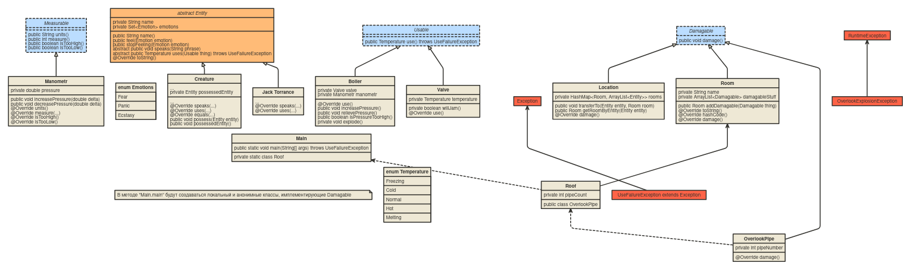

# Задание

1. Построить объектную модель исходя из выданного по варианту текста.
2. Перерисовать диаграмму классов в соответствии с моделью.
3. Согласовать с преподавателем изменения, внесённые в модель.
4. Написать программу, соответствующую разработанной модели.

## Текст варианта

```
Оно торопилось по подвалу на слабый желтый свет единственной лампочки, туда, где находилась топка. Оно всхлипывало от страха. Еще немного — совсем немного, — и оно заполучило бы мальчишку вместе с его замечательной, ни с чем не сравнимой силой! Теперь проиграть было нельзя. Это невозможно было допустить. Оно скинет давление в котле, а потом сурово накажет мальчишку.

— Нельзя! — кричало существо. — О нет, нельзя!

Спотыкаясь, оно спешило через комнату к котлу. Половина длинного цилиндрического корпуса раскалилась докрасна, излучая ровный жар. Котел пыхтел, скрежетал и, как чудовищная каллиопа [Каллиопа — клавишный музыкальный инструмент, состоящий из нескольких рядов парных свистков.], с шипением выпускал по всем направлениям облачка пара. Стрелка манометра убежала на дальний конец шкалы.

— Нет, этого нельзя допустить! — закричал смотритель-управляющий.

Существо положило руки — руки Джека Торранса — на вентиль, не обращая внимания на запах горелого мяса, который поднялся от обуглившейся плоти, когда раскаленное докрасна колесо утонуло в ней, будто это была мягкая дорожная грязь. Вентиль поддался. Существо с торжествующим воплем отвернуло его до упора. Из котла с громовым ревом вырвался пар — словно дружно зашипела дюжина драконов. Но прежде, чем пар полностью скрыл из вида стрелку манометра, она явственно начала отклоняться обратно.

— Победа! — завопило существо. В поднимающемся горячем тумане оно выделывало непристойные па, размахивая над головой охваченными пламенем руками. — Успел! Победа! Успел! Успел вовремя!

Слившиеся в пронзительный вопль торжества слова поглотил разрушительный рев — это взорвался котел «Оверлука». 
```

# Разработанная модель



# Исходный код программы

[Проект, выложенный на github](https://github.com/B0nBun/ProgrammingLab3)

# Результат программы

<pre>
[Jack Torrance, Creature] are in the room "basement"
Creature feels Fear
Creature feels Panic
Creature speaks as Jack Torrance: "Нельзя! О нет, нельзя!"
[Jack Torrance, Creature] transferred to "hallway"
[Jack Torrance, Creature] transferred to "boiler-room"
Creature speaks as Jack Torrance: "Нет, этого нельзя допустить!"
Creature tries to use 'Overlook' Boiler
Creature tries to use 'Overlook' Boiler
Creature tries to use 'Overlook' Boiler
Jack Torrance's hands are melting
Boiler's pressure relieved from being too high!
Creature feels Ecstasy
<span style="color: tomato">Exception in thread "main" java.lang.RuntimeException: The 'Overlook' boiler exploded!
        at lib.Boiler.explode(Boiler.java:41)
        at Main.main(Main.java:52)</span>
</pre>

# Выводы

В процессе выполнения этой лабораторной работы я изучил принципы SOLID и STUPID. Ознакомился с работой механизмов ООП в Java (наследование, переопределение, перегрузка), энумерациями, интерфейсами, абстрактными классами. А также хоть сколько-то попробовал развить в себе навыки проектирование моделей и архитектуры определенной предметной области. 